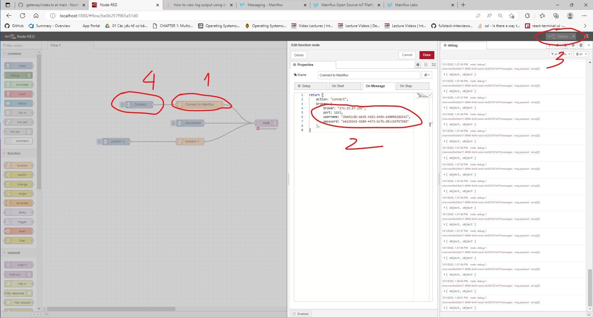

# Mục lục

<!-- @import "[TOC]" {cmd="toc" depthFrom=1 depthTo=6 orderedList=false} -->

## Yêu cầu

- Chạy trên ubuntu server/desktop (> 20.04). Lưu ý là mainflux không chạy được trên wsl, [xem thêm](#mô-phỏng-ubuntu-trên-window)
- [Docker Engine](https://docs.docker.com/engine/install/ubuntu/)/ [Docker Desktop](https://docs.docker.com/desktop/install/ubuntu/)

## Cài đặt docker engine

```bash
curl -fsSL https://get.docker.com -o get-docker.sh
sudo sh ./get-docker.sh
sudo usermod -aG docker $USER
```


## Chạy mainflux

Clone Mainflux về máy

```bash
git clone https://github.com/mainflux/mainflux.git
cd mainflux/docker
```

Copy file .env vào thư mục addons/influx-reader và addons/influx write (.env bị hide nếu muốn xem file đó dùng `ls -a`)

```bash
cp .env addons/influxdb-reader
cp .env addons/influxdb-writer
```

Chạy mainflux

```bash
docker compose up -d
cd addons/influxdb-writer
docker compose up -d
cd ../influxdb-reader
docker compose up -d
```

## Test API

### Cài đặt Postman

Vào [đây](https://www.postman.com/downloads/) để tải về và cài đặt

### Import API

Sau khi cài đặt và đăng nhập postman. Tiến hành tạo workspace mới


Click vào import


Chọn link


Truy cập vào [mainflux-api](https://api.mainflux.io/)


Copy link như hình, dáng vào postman. Lưu ý là chuột phải, copy link mới có tác dụng.


Nhấn continue, tích vào ô copy collection to workspace và nhấn import


Quay trở lại trang [mainflux-api](https://api.mainflux.io/)

Chọn file yml tiếp theo


Lặp lại các bước trên cho đến khi import tất cả vào workspace

### Setup collections

Chọn vào collection, vào tab variables, ở chỗ url điều chỉnh current value của baseUrl thành ip của server chạy mainflux. Bước này sẽ áp dụng cho hầu hết các collection


Tạo user mới (có thể bỏ qua bước này nếu đã tạo user trước đó): Vào tab như hình, chỉnh sửa email passord.


Lấy access token


Sau khi lấy được access token thì qua tab test, chúng ta sẽ thêm script này để các collection khác tự động lấy access token

```Javascript
pm.test("Get acces token", function () {
    var jsonData = pm.response.json();
    pm.expect(jsonData.token).to.be.string;
    pm.globals.set("token", jsonData.token);
});
```


Đoạn script trên sẽ lưu lại acess vào biến môi trường `token` mỗi khi request mới được gọi. Các script collection khác cùng workspace sẽ truy cập được giá trị token.

Giờ thì gọi lại request một lần nữa để token được lưu.

### Tạo thing mới

Vào collection things setup biến môi trường như [trên](#setup-collections)

Sau đó setup như hình


Vào thư mục things, chọn `Adds new thing`


Chạy request, nếu code trả về `201` thì việc tạo đã thành công

Lấy danh sách things như hình sau


Lưu lại `thing key` và `thing id`

### Tạo channel mới

Tạo channel mới. Nếu thành công sẽ trả về `201`


Lấy thông tin channel vừa tạo. Lưu ý là lưu lại `channel id`


### Liên kết things với channel


### Đẩy data vào channel thông qua http

Chỉnh baseUrl thành server-ip/http (vd `localhost/http`)
Sau đó chỉnh authenticate như hình sau. Dòng chữa sau `Thing` chính là `thing key`


Qua tab params, nhập `channel id` vào trường id


Qua tab body, nhập nội dung vào body

```JSON
[
  {
    "bt": 1669627775.83,
    "n": "current",
    "v": 1
  },
  {
    "n": "voltage",
    "v": 220
  }
]
```


Nhấn gửi. Trả về `202` nếu thành công

### Truy xuất giá trị đã gửi thông qua reader

Setup authenticate như [trên](#setup-collections)
Base Url thì set thành server-ip:8905 (vd localhost:8905)


Nhấn gửi, nếu thành công sẽ trả về như sau


## Hiển thị data trên realtime chart

### Requirement

- NodeJS version từ 16 trở lên (các phiên bản cũ hơn chưa test)
- Kiến thức cơ bản về NodeJS, ReactJS, MQTT

### Giải thích đơn giản về NATS và protobuf

- NATS: là một message queue dựa theo mô hình pub/sub tương tự như MQTT, các topic cũng tương tự chỉ khác một tí về wildcard (NATS dùng `">"` thay vì `"*"`, dùng `"*"` thay vì `"#"`), topic url (NATS dùng `"."` thay vì `"/"`).
- protobuf: là một chuẩn để mã hoá các gói tin do google phát triển. Các gói tin được mã hoá theo một "schema" (gọi vầy cho dễ hiểu thôi) lưu trong file với định dạng `.proto`. Trong phạm vi ứng dụng thì ta chỉ cần decode tin nhắn. Việc này khá dễ dàng, chỉ cần sử dụng một thư viện, load file `.proto` và gọi method decode ra là được.

### Mô hình triển khai


### Bắt gói tin từ NATS

Khởi tạo một project mới tại workspace

```bash
mkdir mainflux-guide-backend
cd mainflux-guide-backend
npm init -y
```

Cài đặt dependencies

```bash
npm install nats protobufjs mqtt
```

Ý nghĩa của từng dependency:

- [nats](https://www.npmjs.com/package/nats): Nats client dùng để bắt gói tin từ nats của mainflux
- [protobufjs](https://www.npmjs.com/package/protobufjs): Dùng để decode protobuf
- [mqtt](https://www.npmjs.com/package/mqtt): Dùng để republish gói tin đã decode lên mqtt broker riêng. Web browser subcribe vào broker này để lấy gói tin và hiển thị.

Tạo file index.js và thêm đoạn code sau:

```Javascript
const { connect } = require("nats");

async function main() {
  const nc = await connect({ servers: "172.23.87.193:4222" }); // Chỗ này sửa lại thành server ip
  const s1 = nc.subscribe(">");
  console.log("subscribed to channels.>");
  async function printMsgs(s) {
    for await (const m of s) {
      console.log(m.data.toString());
    }
  }

  printMsgs(s1);
  await nc.closed();
}
main();
```

Chạy đoạn code trên

```bash
node .
```

Giải thích: Đoạn code trên sẽ bắt gói tin từ nats và in ra màn hình.
Sau đó dùng [mainflux http agent](#đẩy-data-vào-channel-thông-qua-http) để đẩy một gói tin bất kì.

Kết quả in ra:


Gói tin của nats sử dụng protobuf để encode. Chúng ta cần phải dùng protobuf để có thể decode ra được gói tin.

### Decode gói tin, chuẩn hoá theo định dạng của reader và gửi lên mqtt broker riêng

Vào folder của mainflux, vào `pkg/messaging` copy file `message.proto` và dáng vào thư mục `mainflux-guide-backend`, hoặc truy cập vào [message.proto](https://github.com/mainflux/mainflux/blob/master/pkg/messaging/message.proto) trên git, copy, tạo file `message.proto` tại thư mục `mainflux-guide-backend` và dán vào.

Lúc này folder `mainflux-guide-backend` có định dạng như sau


Sửa file `index.js` như sau:

```Javascript
const { connect } = require("nats");
const protobuf = require("protobufjs");
const mqtt = require("mqtt");
async function main() {
  //Kết nối tới nats của mainflux
  const nc = await connect({ servers: "172.23.87.193:4222" }); // Chỗ này sửa lại thành server ip
  //Kết nối tới broker riêng. Lưu ý: broker này không được trùng với broker của mainflux
  const mqttClient = mqtt.connect("mqtt://localhost:1883");

  //subscribe vào channels.>
  const s1 = nc.subscribe("channels.>");
  console.log("subscribed to channels.>");

  // load format gói tin từ file message.proto
  const packageProtobuf = protobuf
    .loadSync("message.proto")
    .lookupType("messaging.Message");

  async function printMsgs(s) {
    // Đợi gói tin được gửi đến và xử lý
    for await (const m of s) {
      /**
       * @const decodedPackage: package đuọc decode ra từ protobuf
       */
      const decodedPackage = packageProtobuf.decode(m.data);

      /**
       * @const payload: decodedPackage payload lúc này đang là một Buffer,
       * ta cần chuyển nó qua JSON string sau đó chuyển về một object
       */
      const payload = JSON.parse(decodedPackage.payload.toString());

      /**
       * @const messageAsObject: giống như decodedPackage nhưng lúc này payload
       * là một object
       */
      const messageAsObject = { ...decodedPackage, payload };

      /**
       * @const package: Dùng hàm Normalizer để chuyển format gói tin cho giống với
       * format của reader.
       */
      const package = Normalizer(messageAsObject);

      console.log(package);
      if (mqttClient.connected) {
        //Gửi gói tin vào topic "data"
        mqttClient.publish("data", package);
      }
    }
  }

  printMsgs(s1);
  await nc.closed();
}
main();

function Normalizer(sample) {
  let tempPayload = sample.payload;
  const baseProperties = [
    { name: "ver", label: "version" },
    { name: "t", label: "time" },
    { name: "n", label: "name" },
    { name: "u", label: "unit" },
    { name: "v", label: "value" },
    { name: "s", label: "sum" },
  ];
  tempPayload = tempPayload.map((s) => {
    return baseProperties.reduce((a, { name, label }) => {
      const value = s[name] || tempPayload[0]["b" + name];
      if (value !== undefined) {
        return { ...a, [label]: value };
      }
      return a;
    }, {});
  });
  const finalResult = tempPayload.map((pl) => {
    return {
      channel: sample.channel,
      publisher: sample.publisher,
      protocol: sample.protocol,
      ...pl,
      time: pl.time,
    };
  });
  return finalResult;
}
```

Giải thích:

Đoạn code trên sẽ bắt gói tin từ nats, decode và format lại cho giống với format lấy được từ `reader`. Lý do sử dụng format của `reader` là vì các chart ban đầu sẽ lấy data cũ từ `reader` ra, đồng nghĩa với việc chart sẽ được lập trình để hiểu được format này, nếu gói tin realtime cũng nên có format tương tự thì chart sẽ hiểu được và render ra thông tin realtime.

Một lưu ý khác về việc sử dụng mqtt broker riêng:

- Mainflux đã tích hợp sẵn mqtt broker bên trong, tuy nhiên để kết nối tới broker này thì sẽ cần tới `thing key`, `thing id`, `channelid` và web browser cũng không nên nắm những thông tin này (về vấn đề bảo mật). Vây nên broker này chỉ nên dùng để kết nối với `things`.
- Các mqtt broker từ free cho đến trả phí đều có hỗ trợ kết nối thông qua websocket, đều này đồng nghĩa với việc web browser có thể kết nối và subscribe vào topic mà nó cần quan tâm. So với sử dụng `socket.io` thì cơ chế này hay hơn rất nhiều vì việc kiểm soát rooms của `socket.io` rất khó để implement nếu không có một requirement rõ ràng.

Một số thông tin thêm:

- Định dạng gói tin bắt được sau khi decode (`decodedPackage`):
  ```Javascript
  Message {
    channel: '8e2dbd11-6898-4d44-aecb-4a3227b7af1f',
    publisher: '2be92c8b-8a35-4153-8496-a3009828d242',
    protocol: 'http',
    payload: <Buffer 5b 0a 20 20 7b 0a 20 20 20 20 22 62 74 22 3a 20 31 36 36 39 36 32 37 37 37 35 2e 38 33 2c 0a 20 20 20 20 22 6e 22 3a 20 22 63 75 72 72 65 6e 74 22 2c ... 59 more bytes>,
    created: Long { low: 1774631078, high: 388795828, unsigned: false }
  }
  ```
- Định dạng gói tin sau khi chuyển payload từ Buffer qua Object (`messageAsObject`):
  ```Javascript
  messageAsObject: {
    channel: '8e2dbd11-6898-4d44-aecb-4a3227b7af1f',
    publisher: '2be92c8b-8a35-4153-8496-a3009828d242',
    protocol: 'http',
    payload: [
      { bt: 1669627775.83, n: 'current', v: 1 },
      { n: 'voltage', v: 220 }
    ],
    created: Long { low: 1731735516, high: 388796315, unsigned: false }
  }
  ```
- Định dạng gói tin khi đẩy lên mqtt
  ```Javascript
  [
    {
      channel: '8e2dbd11-6898-4d44-aecb-4a3227b7af1f',
      publisher: '2be92c8b-8a35-4153-8496-a3009828d242',
      protocol: 'http',
      time: 1669627775.83,
      name: 'current',
      value: 1
    },
    {
      channel: '8e2dbd11-6898-4d44-aecb-4a3227b7af1f',
      publisher: '2be92c8b-8a35-4153-8496-a3009828d242',
      protocol: 'http',
      time: 1669627775.83,
      name: 'voltage',
      value: 220
    }
  ]
  ```

### Mô phỏng devices sử dụng node-red (cơ bản)

Chạy một mqtt broker riêng

Lưu ý là cần phải enable websocket, điều chỉnh port cho khác với port của mainflux nếu mainflux được chạy trên cũng 1 máy với broker

Recommend sử dụng [emqx broker](https://www.emqx.io/downloads)

Cài đặt node-red và chạy node-red

```bash
npm install -g node-red
node-red
```

Mở browser lên và truy cập vào http://localhost:1880.
Sau khi page node-red được load, nhấn tổ hợp `Ctrl + i`
Dán nội dung của file [flow.json](./mainflux-node-red/flow.json) vào và nhấn deploy trên góc phải.
Kết quả:


Double click vào `function 1` sửa biến `channelId` thành `channel id` đã tạo trước đó


Double click vào `Connect to Mainflux`, sửa `broker` thành `mainflux server ip`, `username` thành `thing id`, `password` thành `thing key` sau đó deploy rồi `click` `connect`.



Để tạm dừng việc đẩy dữ liệu thì ấn vào disconnect, muốn đẩy tiếp thì ấn vào connect là được

Note:

- Node-red sẽ đẩy dữ liệu 1 lần/s
- Hãy đảm bảo máy chạy node-red và mainflux server cùng một mạng (nếu dùng wsl để chạy node-red, mainflux server nằm trên máy ảo hoặc một máy khác sẽ không kết nối được).
- Dùng chương trình `mainflux-guide-backend` vừa viết bên trên để kiểm tra xem node-red có push được tin lên không.
- Dữ liệu được đẩy lên sẽ bao gồm một `voltage` có giá trị là `Math.random()*10` và một current `Math.random()*2`
- Timestamp của senml là Unix timestamp (số giây kể từ 1/1/1970) khác với Date.now() của NodeJS (số mili giây kể từ 1/1/1970), tức là lấy thời gian của nodejs, chia 1000, lấy 2 chữ số sau dấu phẩy.

### Hiển thị dữ liệu realtime với ReactJS

Tạo project React

```bash
npx create-react-app mainflux-guide-ui
cd mainflux-guide-ui
npm install react-apexcharts mqtt
npm install -g webpack webpack-cli
cd node_modules/mqtt
npm install .
webpack ./mqtt.js --output-library mqtt
cd ../..
npm start
```

Copy đoạn code sau và dán vào App.js

```Javascript
import "./App.css";
import Chart from "react-apexcharts";

//mqtt client ở browser bắt buộc phải dụng webpack để compile và import như thế này
//(đã nghiên cứu một vài issue trên git)
import mqtt from "mqtt/dist/mqtt";

import { useEffect, useState } from "react";
function App() {
  const [voltages, setVoltages] = useState([]);
  const [currents, setCurrent] = useState([]);

  //options cho chart, có thể lên trang chủ apexchart để xem thêm
  const options = {
    chart: {
      id: "realtime",
      height: 350,
      type: "line",
      animations: {
        enabled: true,
        easing: "linear",
        dynamicAnimation: {
          speed: 999,
        },
      },
      toolbar: {
        show: false,
      },
      zoom: {
        enabled: false,
      },
    },
    dataLabels: {
      enabled: false,
    },
    stroke: {
      curve: "smooth",
    },
    title: {
      text: "Dynamic Updating Chart",
      align: "left",
    },
    markers: {
      size: 0,
    },
    xaxis: {
      type: "datetime",
      range: 20000,
    },
    yaxis: {
      max: 10,
    },
    legend: {
      show: false,
    },
  };

  useEffect(() => {
    //Kết nối tới broker
    const client = mqtt.connect("ws://localhost:8083/mqtt"); // thay địa chỉ trên đến broker riêng
    client.once("connect", () => {
      console.log("connected to mqtt broker");
    });
    //Subscribe channel data
    client.subscribe("data");

    //Xử lý khi có package gửi đến
    client.on("message", (_topic, message) => {
      const messageAsJSON = JSON.parse(message);

      //cập nhật các state tuỳ theo item của package
      for (const item of messageAsJSON) {
        if (item.name === "voltage") {
          setVoltages((voltages) => {
            const newArray = [
              ...voltages,
              { x: new Date(item.time * 1000), y: item.value },
            ];
            return newArray;
          });
        }
        if (item.name === "current") {
          setCurrent((currents) => {
            const newArray = [
              ...currents,
              { x: new Date(item.time * 1000), y: item.value },
            ];
            return newArray;
          });
        }
      }
    });
    // Xoá bớt giá trị của state sau một chu kì, glitch nhẹ đồ thị.
    // Điều này là cần thiết để tránh memory leak.
    // Đã nghiên cứu cách để tránh glitch nhưng không khả thi,
    // có thể tăng interval lên nếu cần tăng trải nghiệm người dùng
    const interval = setInterval(() => {
      if (voltages.length > 20) {
        setVoltages((voltages) => {
          const tmp = [...voltages];
          tmp.splice(0, voltages.length - 20);
          return tmp;
        });
      }
      if (currents.length > 20) {
        setCurrent((currents) => {
          const tmp = [...currents];
          tmp.splice(0, currents.length - 20);
          return tmp;
        });
      }
    }, 60 * 1000);

    // Hàm dưới đây sẽ được gọi đến khi component unmout
    // Hàm này cực kì quan trọng, bắt buộc phải có nếu không sẽ dẫn đến memory leak
    return () => {
      //unsub topic data
      client.unsubscribe("data");

      //Xoá listener hiện tại
      client.removeAllListeners();

      //Ngắt kết nối tới broker
      client.end();

      //clear interval
      clearInterval(interval);
    };
    // eslint-disable-next-line react-hooks/exhaustive-deps
  }, []);
  return (
    <div className="App">
      <Chart
        series={[
          { data: voltages, name: "voltage" },
          { data: currents, name: "current" },
        ]}
        options={options}
      />
    </div>
  );
}

export default App;
```

## Các thông tin khác

### Mô phỏng Ubuntu trên window

Lưu ý: Có thể nên download phiên bản ubuntu quen thuộc nhất để sử dụng (lên trang chủ download), recommend `Ubuntu 20.04 LTS`

- [Hyper-V](https://viblo.asia/p/huong-dan-tao-may-ao-ubuntu-bang-hyper-v-tren-windows-10-nam-2020-QpmlejWm5rd)
- [VM-Ware](https://openplanning.net/11299/cai-dat-ubuntu-server-trong-vmware)
- [Multipass](https://multipass.run/install)

### How to use this repo?

Clone code từ repo này về

```bash
git clone
cd mainflux-guide-backend
npm install
cd mainflux-guide-ui
npm install
```

### Nếu phát hiện lỗi hay thắc mắc

- Có thể tạo issue hoặc pull request
- Contact mình qua email tranuyson@gmail.com
